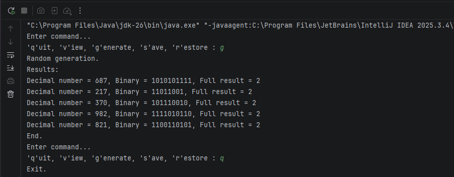

# ✨Завдання 3 - Спадкування

## Реалізовано: 
1. Колекція результатів із можливістю серіалізації/десеріалізації.  
2. Ієрархія фабрикованих об’єктів через Factory Method.  
3. Інтерфейс для відображення результатів (`ResultView`).  
4. Текстове відображення (`TextResultView`).  
5. Інтерфейс фабрики (`ResultFactory`) та конкретна реалізація (`TextResultFactory`).
   
## Результат виконання

