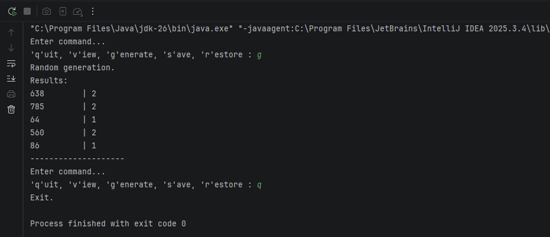

# ✨Завдання 4 - Поліморфізм

## Реалізовано:  
1. Використано вихідний текст попередньої лабораторної роботи. За допомогою шаблону **Factory Method** розширено ієрархію класів для відображення результатів у вигляді **текстової таблиці** з параметрами, що задає користувач.  
2. Продемонстровано **перевизначення (overriding)** методів у похідних класах, **перевантаження (overloading)** методів для різних варіантів відображення та **динамічне призначення (поліморфізм)** через інтерфейс `ResultView`.  
3. Реалізовано **діалоговий інтерфейс** у консольному режимі, що дозволяє користувачеві обирати параметри та тип відображення.  
4. Створено **тестовий клас**, який демонструє роботу фабрик, різні способи відображення результатів та взаємодію з користувачем.  
   
## Результат виконання

