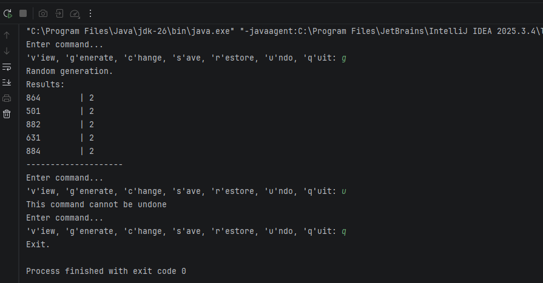

# ✨Завдання 5 - Обробка колекцій

## Мета:
Розробити програму для керування операціями над даними з використанням шаблонів проєктування Command, Singleton.

## Реалізовано:  
1. Використано шаблон Command для організації та виконання команд користувача
2. Створено клас Menu як контейнер команд
3. Application побудовано за шаблоном Singleton, забезпечуючи єдиний екземпляр програми
4. Консольний діалоговий інтерфейс реалізовано для взаємодії з користувачем
5. Undo підтримується через історію виконаних команд та методи undo()

## Команди для роботи з програмою
| Команда	| Дія |
|--------------|-------|
| v	| View |
| g	| Generate |
| c	| Change |
| s	| Save |
| r	| Restore |
| u	| Undo |
| q	| Quit |

## Результат виконання

