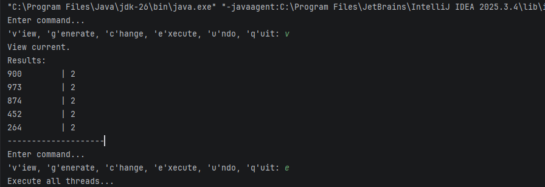
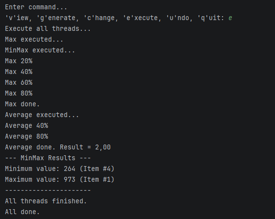

# ✨Завдання 6 - Паралельне виконання

## Мета:
1. Продемонструвати можливість паралельної обробки елементів колекції (пошук мінімуму, максимуму, середнього значення, відбір за критерієм).
2. Реалізувати керування чергою завдань за допомогою шаблону Worker Thread.

## Реалізація:  
1. Команди для обробки колекції
  - MinMaxCmd – знаходить мінімальне та максимальне значення (по першому стовпцю number).
  - AverageCmd – обчислює середнє значення.
2. Worker Thread
- Створюється клас CmdQueue, який реалізує інтерфейс Queue.
- У ньому є внутрішній клас Worker, що постійно бере команди з черги та виконує їх у окремому потоці.
- Користувач додає команди через put(), а Worker їх обробляє паралельно.
3. Паралельність
- Кожна команда виконується у власному потоці.
- Під час виконання показується прогрес (20%, 40%, …).
- Завдяки Worker Thread користувач може додавати нові команди, не чекаючи завершення попередніх.

## Результат виконання

