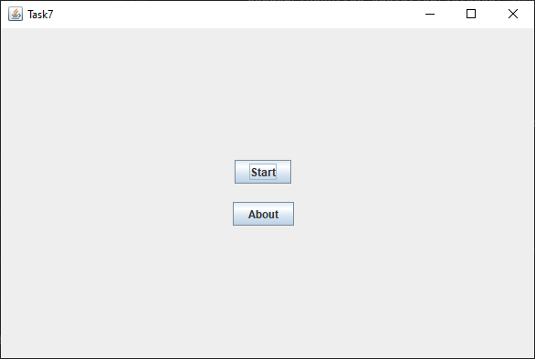
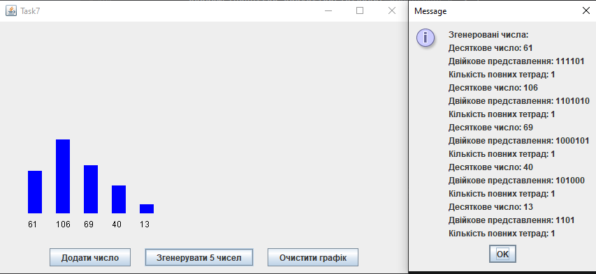

# ✨Завдання 7 - Графічний інтерфейс

## Мета:
1. Розробити ієрархію класів відповідно до шаблону Observer (java) та продемонструвати можливість обслуговування розробленої раніше колекції (об'єкт, що спостерігається, Observable) різними (не менше двох) спостерігачами (Observers) – відстеження змін, упорядкування, висновок, відображення і т.д.
2. При реалізації ієрархії класів використати інструкції (Annotation). Відзначити особливості різних політик утримання анотацій (annotation retention policies). Продемонструвати підтримку класів концепції рефлексії (Reflection).
3. Використовуючи раніше створені класи, розробити додаток, що відображає результати обробки колекції об'єктів у графічному вигляді
4. Забезпечити діалоговий інтерфейс з користувачем та перемальовування графіка під час зміни значень елементів колекції.

## Реалізація:
1. Ієрархія класів (Observer pattern)
- NumberCollection – клас, що зберігає список чисел та повідомляє спостерігачів про зміни.
- NumberObserver – інтерфейс спостерігача.
- ConsoleNumberObserver – спостерігач, який виводить колекцію та дані по кожному числу в консоль.
- BarChartObserver – спостерігач, який оновлює графічну панель.
- BarChartPanel – панель, що малює стовпчикову діаграму з підписами чисел.
2. Графічний інтерфейс (Swing)
- Клас Main створює головне вікно з меню (Start, About) та панель завдання.
- Використовується CardLayout для перемикання між меню та панеллю завдання.
3. Анотації та рефлексія
- Використано стандартні анотації (@Override) для перевизначення методів.
- Можна додати власні анотації для позначення спостерігачів та через рефлексію перевіряти, які класи реалізують інтерфейс NumberObserver.
4. Діалоговий інтерфейс
- Використовується JOptionPane для взаємодії з користувачем (введення числа, повідомлення про результати).
- Графік автоматично перемальовується при зміні колекції.
## Результат виконання

